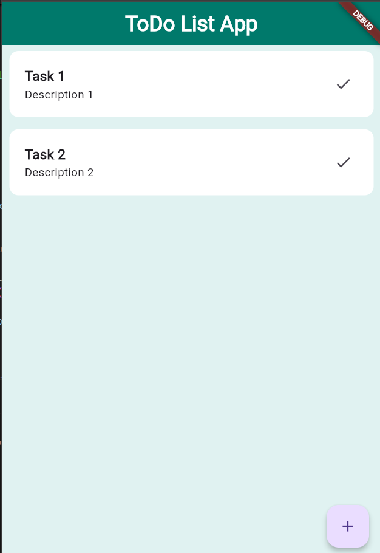
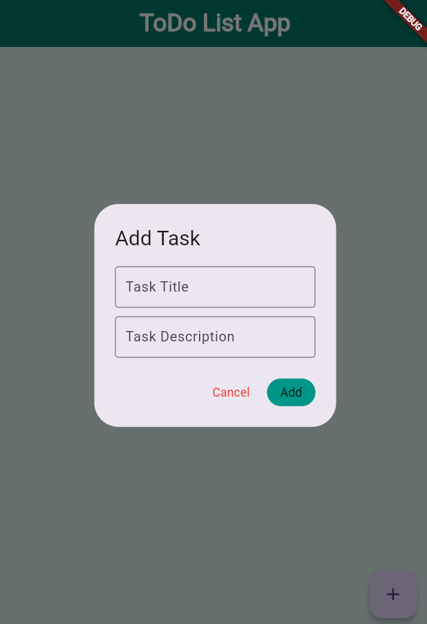

# todo_app

A new Flutter project.

## Getting Started

This project is a starting point for a Flutter application.

A few resources to get you started if this is your first Flutter project:

- [Lab: Write your first Flutter app](https://docs.flutter.dev/get-started/codelab)
- [Cookbook: Useful Flutter samples](https://docs.flutter.dev/cookbook)

For help getting started with Flutter development, view the
[online documentation](https://docs.flutter.dev/), which offers tutorials,
samples, guidance on mobile development, and a full API reference.

## Installation

1. Clone the repository:
    ```bash
    git clone https://github.com/dilushamadushan/todo_app_flutter.git
    ```
2. Navigate to the project directory:
    ```bash
    cd todo_app_flutter
    ```
3. Install dependencies:
    ```bash
    flutter pub get
    ```
4. Run the app:
    ```bash
    flutter run
    ```

## Screenshots



## Contributing

Contributions are welcome! Please follow these steps:

1. Fork the repository.
2. Create a new branch for your feature or bug fix.
3. Commit your changes and push to your fork.
4. Submit a pull request.
